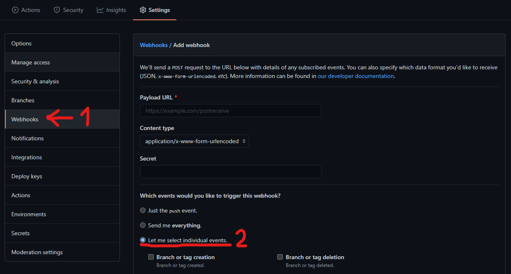
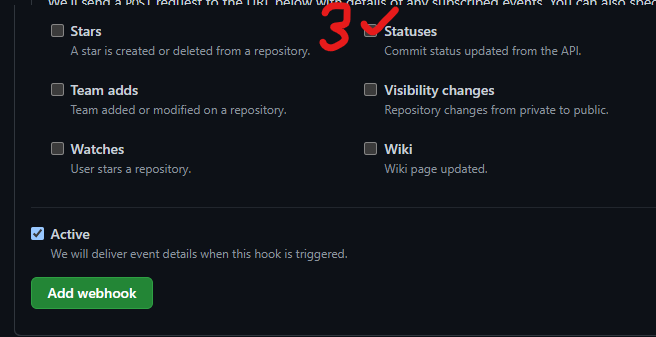

# Merge Train

[](https://opensource.org/licenses/MIT)

[](https://github.com/tohaker/merge-train/actions)

This project consists of Node JS Azure serverless functions that make up the Merge Train bot. These are as follows;

- A function that can be invoked through a Slack Bot to keep track of a growing list of Merge requests.
- A function that is invoked by Github Webhooks whenever a PR is modified.

## Using the Slack Bot

The proposed contract for interacting with the bot on Slack is as follows:

- `/merge next` - Display the next URL in the list. This will not remove it from the list.
- `/merge list (public)` - Display all URLs in the list, in the order they were added. Add `public` to share this list with the channel.
- `/merge pause` - Pause the merge train. While paused, no automatic merges will be triggered.
- `/merge resume` - Resume the merge train.
- `/merge help` - Display this contract to the user as an ephemeral message.

## Using the Github App

The Github App function will be invoked when the chosen webhooks are triggered.

| Action           | Output                                                                                                                                                                                                                                                                                                                                                          |
| ---------------- | --------------------------------------------------------------------------------------------------------------------------------------------------------------------------------------------------------------------------------------------------------------------------------------------------------------------------------------------------------------- |
| Labeled          | If the label mentions "Ready for merge", a receipt will be posted to the "merge" Slack channel. If the merge train has been paused previously, this will apply the same `merge train paused` label to the newly labeled PR.                                                                                                                                     |
| Unlabeled        | If the label mentions "Ready for merge", a receipt will be posted to the "merge" Slack channel.                                                                                                                                                                                                                                                                 |
| Review Requested | A message will be posted to the "reviews" Slack channel, tagging the users requested. To avoid duplicate calls, this app is setup to only look for a `requested_team` property, as this indicates users have been selected from an organisation team by GitHub. If your organisation does not use this, you will need to modify this code to ignore this field. |
| Status changed   | If you have a CI pipeline linked to Github, Status changes will trigger the webhook. If a status becomes `success` and applies to the default branch (see Configuration below), it will trigger the next PR in the list to be merged.                                                                                                                           |

## Configuration

### Creating the Slack App

You'll need to create a Slack App for deployment. You can find instructions on how to do this [in the Slack API documentation](https://api.slack.com/). At least one [Slash Command](https://api.slack.com/interactivity/slash-commands) will be needed for interactivity with Slack Bot.

### Creating the GitHub App

You'll need to create a GitHub App for deployment. You can find instructions on how to do this [in the GitHub documentation](https://docs.github.com/en/developers/apps/creating-a-github-app).

The following App permissions will need to be set:

| Permission      | Level        |
| --------------- | ------------ |
| Pull requests   | Read & Write |
| Commit statuses | Read-only    |

This app will need to be installed in the repository you wish to track, and an additional webhook for Status events will need to be set in the repository.

[](docs/ghapp_1.png)
[](docs/ghapp_2.png)

### Code config file

Some basic configuration options are available for the functions. The [config](common/config.ts) file contains these options to be changed;

| Option      | Purpose                                                                                                                                                                      | Default                                 |
| ----------- | ---------------------------------------------------------------------------------------------------------------------------------------------------------------------------- | --------------------------------------- |
| ChannelName | Slack channels where you wish `merge` and `review` messages to be sent. These do not need to be different.                                                                   | `merge`, `reviews`                      |
| Branch      | List of branches that are meaningful within the context of these functions. Only `DEFAULT` is defined, and this corresponds to the default branch of your GitHub repository. | `master`                                |
| Label       | Label names used in Github to represent various PR states                                                                                                                    | `ready for merge`, `merge train paused` |
| icon_emoji  | The emoji to use in Slack messages                                                                                                                                           | `:steam_locomotive:`                    |

If you want Slack users to be tagged in the reviews, they will need to add their GitHub login ID to their Slack profile under "What I do". If this is not filled, the GitHub ID will be posted instead.

## Deployment

Deployment is handled through [Terraform](terraform.io), using an Azure Service Principal to autheticate with an Azure account. See the following table for the Environment Variables the deployment expects;

| Variable Name        | Purpose                                                                                                                                                                                                                                |
| -------------------- | -------------------------------------------------------------------------------------------------------------------------------------------------------------------------------------------------------------------------------------- |
| ARM_ACCESS_KEY       | The storage access key for saving Terraform state files. If you don't need this, remove the `backend` block from [the provider file](deployment/provider.tf)                                                                           |
| ARM_CLIENT_ID        | Azure service principal app ID                                                                                                                                                                                                         |
| ARM_CLIENT_SECRET    | Azure service principal password                                                                                                                                                                                                       |
| ARM_SUBSCRIPTION_ID  | Azure subscription to deploy to                                                                                                                                                                                                        |
| ARM_TENANT_ID        | Azure service principal tenant                                                                                                                                                                                                         |
| SLACK_BOT_TOKEN      | Slack OAuth token required for posting and listening to messages                                                                                                                                                                       |
| SLACK_SIGNING_SECRET | Secret used to authenticate messages coming from Slack                                                                                                                                                                                 |
| GHAPP_SECRET         | GitHub App secret required to authenticate messages coming from GitHub                                                                                                                                                                 |
| GHAPP_PRIVATE_KEY    | The private RSA key generated by GitHub when your app is first created. This is needed to generate JWTs for the GraphQL endpoint to act as your app.                                                                                   |
| GH_APP_ID            | The GitHub app ID, found on your app's info page.                                                                                                                                                                                      |
| GH_INSTALLATION_ID   | The ID of the installation that your app should access. Information on how to find this is [in the GitHub documentation](https://docs.github.com/en/developers/apps/authenticating-with-github-apps#authenticating-as-an-installation) |
| GH_HOSTNAME          | The hostname for the GraphQL endpoint. If you use public GitHub, **you do not need to set this**; Only set it if you have an Enterprise Github app.                                                                                    |
| GH_OWNER             | The name of the owner of the repository your app will be monitoring. If your repository is `https://github.com/myOrg/hello-world.git` then `myOrg` is the owner.                                                                       |
| GH_REPOSITORY        | The name of the repository your app will be monitoring. If your repository is `https://github.com/myOrg/hello-world.git` then `hello-world` is the repository name.                                                                    |

Before running the terraform deployment, you have to package the apps. This can be done by running

```bash
npm i
npm run build

npm ci --only=prod  # Dev dependencies aren't needed and will bloat the function zip files
npm i -g @ffflorian/jszip-cli mkdirp
npm run build:zip
```

To run the deployment manually, you'll need the [Azure CLI](https://docs.microsoft.com/en-us/cli/azure/install-azure-cli) and be logged into an account with an active subscription. Then run the following;

```bash
cd deployment
terraform init
terraform apply
```

This repostory also includes a [GitHub Actions workflow](.github/workflows/deploy.yml) as an example of how to deploy the apps in a CI environment.

## Local testing

[Azure Functions Core Tools](https://docs.microsoft.com/en-us/azure/azure-functions/functions-run-local) are needed to run this project locally.

If you build and run the project in the VSCode DevContainer all prerequisites will be installed automatically - this is the recommended method of development.

To run the function locally;

```bash
npm i
npm start
```

This will install all dependencies and begin running the function on a random port. You can then send POST requests to interact with the bot.

Unit tests are also available to run with

```bash
npm t
```
